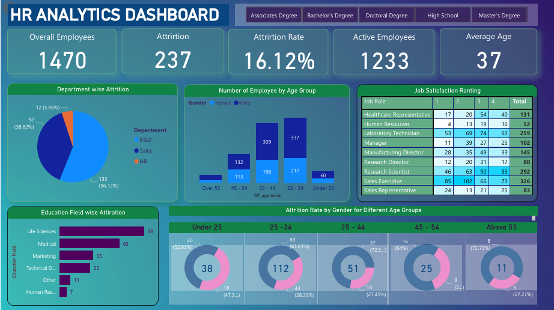

[README (1).md](https://github.com/user-attachments/files/26083927/README.1.md)
# HR Analytics Dashboard — Employee Attrition Analysis


---

## Overview

An interactive Power BI dashboard analysing employee attrition across a workforce of **1,470 employees**. The dashboard helps HR leadership identify *who* is leaving, *why* they are leaving, and *where* to focus retention efforts — using filters for education level, department, age group, and gender.

---

## Dashboard Preview



---

## Problem Statement

> **"Which employee segments are most at risk of attrition, and what factors are driving them to leave?"**

High attrition is expensive — it affects team stability, productivity, and hiring costs. This dashboard turns raw HR data into clear, actionable insight for decision-makers.

---

## Dataset

| Detail | Info |
|--------|------|
| Source | IBM HR Analytics Employee Attrition Dataset (Kaggle) |
| File | HR_DATA_Excel.xlsx |
| Records | 1,470 employees |
| Features | Age, Department, Job Role, Education, Gender, Salary, Job Satisfaction, Attrition Status |

---

## Key KPIs

| Metric | Value |
|--------|-------|
| Total Employees | 1,470 |
| Total Attrition | 237 |
| Attrition Rate | 16.12% |
| Active Employees | 1,233 |
| Average Age | 37 years |

---

## Dashboard Sections

### 1. Department-wise Attrition
- **R&D** accounts for the majority — **56.12%** of total attrition (133 employees)
- **Sales** follows with **38.82%** (92 employees)
- **HR** has the lowest at **5.06%** (12 employees)

### 2. Employees by Age Group
- The **25–34** age band has the highest headcount (337 male + 217 female)
- The **Under 25** group is the smallest (60 employees)

### 3. Job Satisfaction Rating
Ratings tracked across job roles on a scale of 1–4:

| Job Role | Total Employees |
|----------|----------------|
| Sales Executive | 326 |
| Research Scientist | 292 |
| Laboratory Technician | 259 |
| Manufacturing Director | 145 |
| Healthcare Representative | 131 |
| Manager | 102 |
| Sales Representative | 83 |
| Research Director | 80 |
| Human Resources | 52 |

### 4. Education Field-wise Attrition
- **Life Sciences** has the highest attrition count: **89**
- Followed by **Medical (63)**, **Marketing (35)**, **Technical Degree (32)**

### 5. Attrition Rate by Gender & Age Group
| Age Group | Total Attrition | Male % | Female % |
|-----------|----------------|--------|----------|
| Under 25 | 38 | 52.63% | 47.37% |
| 25–34 | 112 | 61.61% | 38.39% |
| 35–44 | 51 | 72.55% | 27.45% |
| 45–54 | 25 | 64% | 36% |
| Above 55 | 11 | 72.73% | 27.27% |

---

## Key Insights

1. **R&D and Sales are the highest-risk departments** — together they account for nearly 95% of all attrition. Targeted retention programmes in these two departments alone could significantly reduce overall turnover.

2. **Employees aged 25–34 are leaving the most** — 112 out of 237 total attritions. This suggests dissatisfaction in early-to-mid career stages, possibly related to growth opportunities or compensation.

3. **Male employees leave at higher rates across all age groups** — particularly in the 35–44 band (72.55%), indicating potential issues around mid-career progression for men.

4. **Life Sciences graduates are the most likely to leave** — with 89 attritions, nearly double the Medical field. This may reflect better external market opportunities for this skill set.

5. **Sales Executives have the largest workforce but also face high dissatisfaction scores** — a key segment to monitor for future attrition risk.

---

## Tools & Techniques

| Tool | Usage |
|------|-------|
| Power BI Desktop | Dashboard design, visualisation, interactivity |
| DAX | Custom measures — attrition rate, headcount, satisfaction averages |
| Power Query | Data cleaning, column formatting, type transformation |
| Slicers | Filter by Education Level (Associates, Bachelor's, Doctoral, High School, Master's) |
| Donut & Bar Charts | Attrition breakdowns by gender, age, department, education |

---

## How to Use

1. Download or clone this repository
2. Open `HR_Dashboard.pbix` in **Power BI Desktop** (free download from Microsoft)
3. Use the **education filter buttons** at the top to slice data by degree type
4. Hover over any chart for detailed tooltips
5. The dataset file `HR_DATA_Excel.xlsx` is included for reference

> **Don't have Power BI?** View the dashboard screenshot above — all key insights are visible in `HR_Dashboard_.png`

---

## Files in This Repository

```
hr-attrition-dashboard-powerbi/
│
├── HR_Dashboard.pbix        # Power BI dashboard (open in Power BI Desktop)
├── HR_DATA_Excel.xlsx       # Source dataset
├── HR_Dashboard_.png        # Dashboard screenshot
└── README.md                # Project documentation
```

---

## Author

**Siddharth Kamble**
MSc Data Science — University of Essex, UK

[](https://www.linkedin.com/in/siddharth-kamble-data-analyst)

---

## License

This project uses a publicly available dataset from Kaggle (IBM HR Analytics).
Free to use for educational and portfolio purposes.
